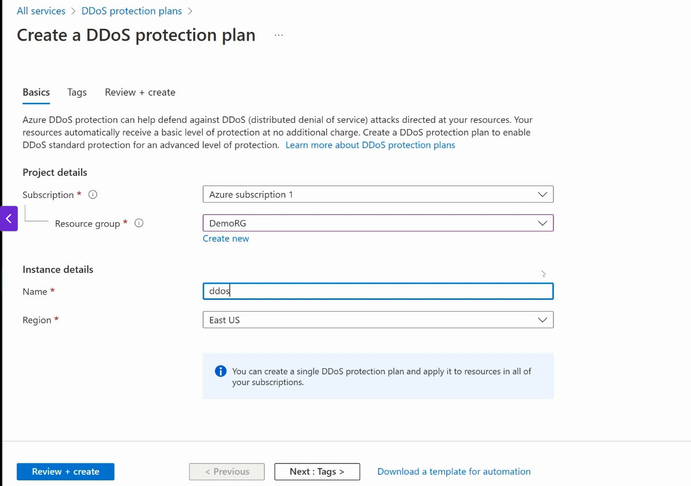
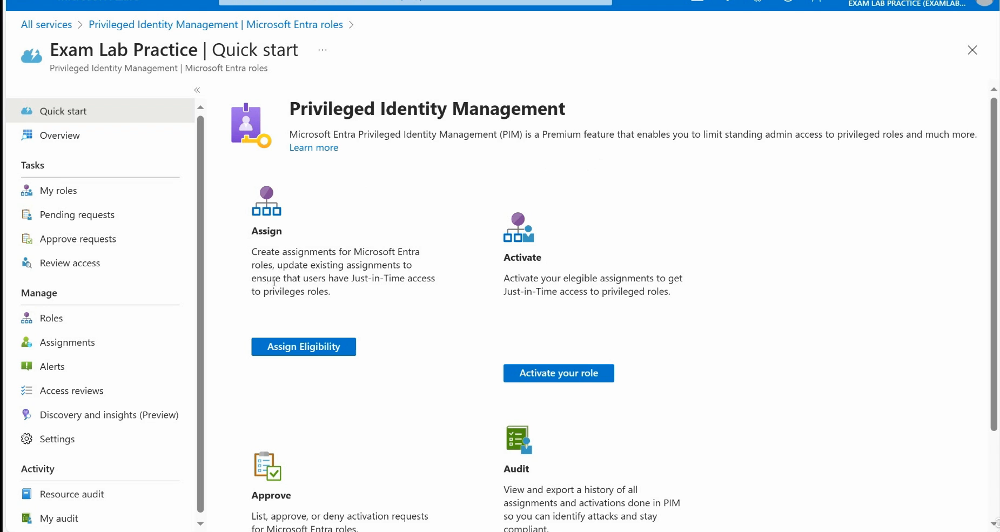
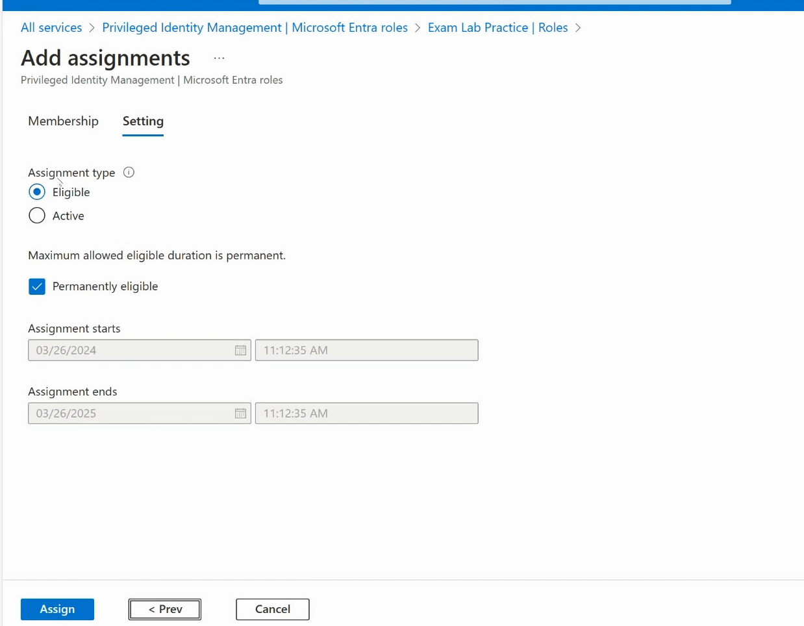
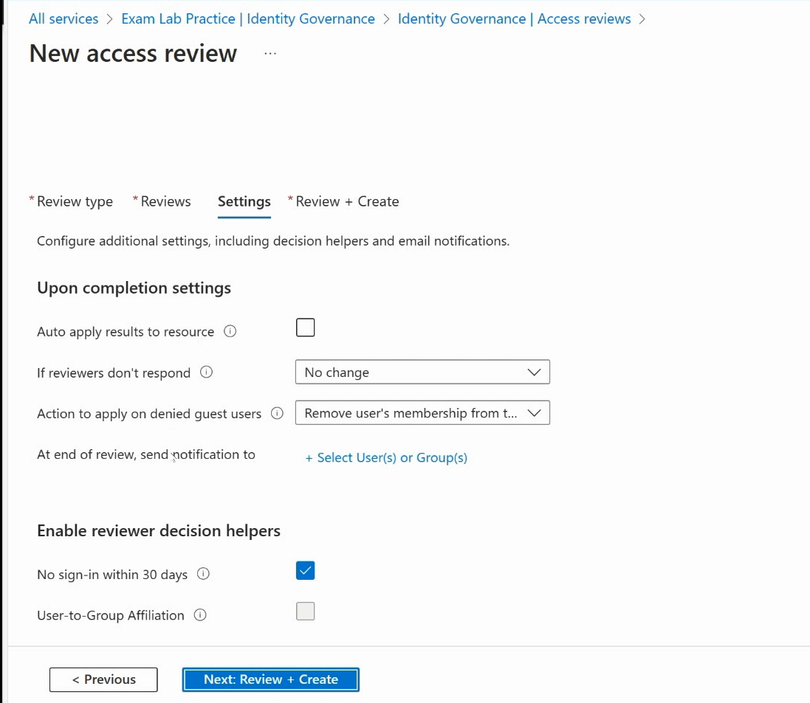

# AZ 305 Training (Designing Azure Infrastructure)
## Basic Concepts
- 
- 

## Designing solutions for Logging and Monitoring
- 
- 
- Azure Monitor combines all the monitoring activities across all of Azure in a single space.
- 
- Metrics are numeric values and we can build charts off that data
- 
- 
- 
- Azure Monitor is free but for storing analytics data, it will cost us money
- In Windows, we used to use PerfMon to gather metrics data, Azure Monitor greatly improves on that.
- 
- 
- We need to know how we will get our log information into the Log Analytics Workspace. For this purpose we will use Data Collection Rules in Azure Monitor
- 
- 
- 
- 
- 
- 
- 
- We can also put Resource Locks on our Log Analytics Workspace.

### Setting up Alerts in Azure Monitor
- 
- Signals are conditions for which we want to generate an alert
- 
- We can then create action groups
- 
- 
- 
- 
- 

### Azure Advisor
- 
- We can see a list of cost recommendations
- 

### Using Azure DDoS protection
- 
- 
- 
- 
- 

## Designing Authentication and Authorization Solutions
- 
- 
- 
- 
- RBAC allows an administrator to give privileges to other users/administrators control over the environment.
- Roles allow us to see what privileges the users are getting.
- 
- Global Administrator is the highest role in Azure
- PIM means we can give role access temporarily.
- Users can also request permissions for a short period of time.
- 
- 
- 
- 
- 
- 
- 
- We can create custom roles as well
- 
- 
- 
- 
- 
- We can apply Scopes in a hierarchy
- 
- Management Group is used to group together subscriptions
- 
- 
- PIM(Privileged Identity Management) is a technology that allows us to manage, control and monitor access to resources in the organization. These resources can be inside Microsoft Entra ID, Azure or other Microsoft Online Services such as Microsoft 365 or Microsoft Intune.
- One example of PIM is to give access to resources for a short period of time(Remember SAS tokens)
- 
- 
- We can conduct Access Reviews to ensure users still need roles.
- Using PIM, we can enforce Multi-Factor Authentication.
- Users who can manage PIMs include Privileged Role Admin or Global Admins
- 
- Remember JIT Access
- 
- 
- 
- We can set the date and time to start and end the role assignment
- 
- 
- 
- 

### Access Reviews
- 
- 
- 
- 
- 
- 
- 
- 
- 

## Design Governance
- Management group is a root hierarchial system that allows us to separate our different subscriptions
- Subscription allows us to purchase Azure resources.
- Even free resources need to be associated with a subscription
- 
- 
- Resource Groups cannot be nested
- 
- We can have a root management group and then have sub management groups below it
- Each management group can have subscriptions associated with it.
- 

### Administrative Units
- In Active Directory, we used to have Organization Units(OU)
- We used to put users inside of an OU and then we could delegate control over resources in that unit.
- Administrative Units(AU) are similar in concept but with some differences.
- AU help us to categorize our objects together and then we can delegate control over those objects to certain administrators.
- 
- 
- We need Azure AD Premium 1 license to create administrative units
- 
- 
- 
- 
- 
- In OU, 1 user can be member of one OU only. In AU, a user can be member of several AUs.
- 
- 
- 
- Microsoft Defender for Cloud gives us an overview of the security requirements for our cloud infrastructure.
- We need to pay close attention to security recommendations
- 
- 

## Design Identities and Access for Applications
- 
- Use principle of least privilege
- In Zero Trust Model, we follow JIT Model
- For this we use PIM
- In Azure we have Conditional Access Policies and Compliance Access Policies.
- Zero trust model is all about verifying everything

### Azure Key Vault
- 
- 
- 
- In Azure Key vault we can setup permission model either to be a Vault Access Policy or Azure RBAC.
- 
- In Vault access policy we can decide who can do what inside the key vault like whether we can create a key, certificate etc.
- Access Control(IAM) blade allows us to control who has access to these access policies and whether he/she can change the access policy.
- Azure Key Vault is a way to allow tenants or users in Azure to manage their encryptions like encryption keys.
- 
- 
- 
- We can also rotate our keys inside the Azure Key Vault
- 
- 
- 
- We can also do a soft delete of a key

### Application Access Registration(App Registrations) in Azure AD
- Suppose a web app is hosted on-prem on a webserver.
- We want that application to be tied to Azure AD and allow Azure AD to authenticate users and provide a token and control who gets access to that application.
- We want to use Azure AD to authenticate our users on that web app.
- Azure AD has a concept of App Registration and we can generate an access token which is passed to the web-server.
- 
- 
- This will generate an access token and it will be passed to the web app and the developer needs to use it accordingly
- 
- 
- 
- We have a bunch of endpoints associated with it which the developer needs to use to authenticate the token
- 

### Azure AD Application Proxy
- It is a feature of Azure AD that enables users to access on-premise web applications from a remote client.
- Application proxy includes both the Application Proxy service which runs in the cloud and the Application Proxy connector which runs on an on-premises server.
- Think of it as an alternative to Reverse Proxy.
- Azure AD, Application Proxy and Application Proxy connector work together to securely pass the user sign-on token from Azure AD to the web application.
- 
- This way we can host an application inside of our own private network and Application Proxy will act as a middleman between our web application hosted in house and the regular internet users.
- 
- 
- Application proxy ensures that we dont have to open any inbound connections to our firewall
- 
- 
- 
- 
- We can download and install the agent on our on-prem server.
- 
- 
- 
- 
- 
- Http Only cookie prevents against XSS attacks, cross site scripting attacks
- Persistent cookies donot expire when browser is closed.
  