# AZ 305 Training (Designing Azure Infrastructure)
## Basic Concepts
- 
- 

## Designing solutions for Logging and Monitoring
- 
- 
- Azure Monitor combines all the monitoring activities across all of Azure in a single space.
- 
- Metrics are numeric values and we can build charts off that data
- 
- 
- 
- Azure Monitor is free but for storing analytics data, it will cost us money
- In Windows, we used to use PerfMon to gather metrics data, Azure Monitor greatly improves on that.
- 
- 
- We need to know how we will get our log information into the Log Analytics Workspace. For this purpose we will use Data Collection Rules in Azure Monitor
- 
- 
- 
- 
- 
- 
- 
- We can also put Resource Locks on our Log Analytics Workspace.

### Setting up Alerts in Azure Monitor
- 
- Signals are conditions for which we want to generate an alert
- 
- We can then create action groups
- 
- 
- 
- 
- 

### Azure Advisor
- 
- We can see a list of cost recommendations
- 

### Using Azure DDoS protection
- 
- 
- 
- 
- 

## Designing Authentication and Authorization Solutions
- 
- 
- 
- 
- RBAC allows an administrator to give privileges to other users/administrators control over the environment.
- Roles allow us to see what privileges the users are getting.
- 
- Global Administrator is the highest role in Azure
- PIM means we can give role access temporarily.
- Users can also request permissions for a short period of time.
- 
- 
- 
- 
- 
- 
- 
- We can create custom roles as well
- 
- 
- 
- 
- 
- We can apply Scopes in a hierarchy
- 
- Management Group is used to group together subscriptions
- 
- 
- PIM(Privileged Identity Management) is a technology that allows us to manage, control and monitor access to resources in the organization. These resources can be inside Microsoft Entra ID, Azure or other Microsoft Online Services such as Microsoft 365 or Microsoft Intune.
- One example of PIM is to give access to resources for a short period of time(Remember SAS tokens)
- 
- 
- We can conduct Access Reviews to ensure users still need roles.
- Using PIM, we can enforce Multi-Factor Authentication.
- Users who can manage PIMs include Privileged Role Admin or Global Admins
- 
- Remember JIT Access
- 
- 
- 
- We can set the date and time to start and end the role assignment
- 
- 
- 
- 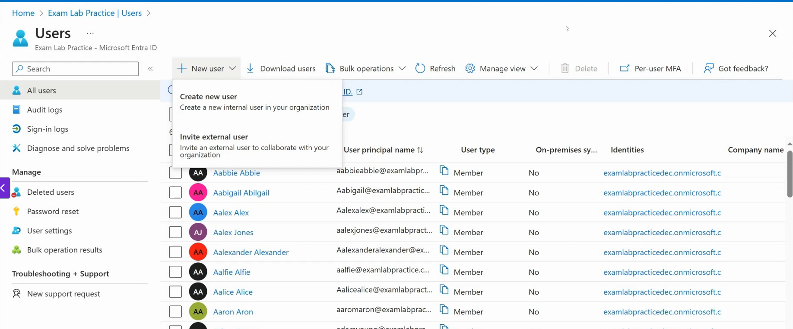

### Access Reviews
- 
- 
- 
- 
- 
- 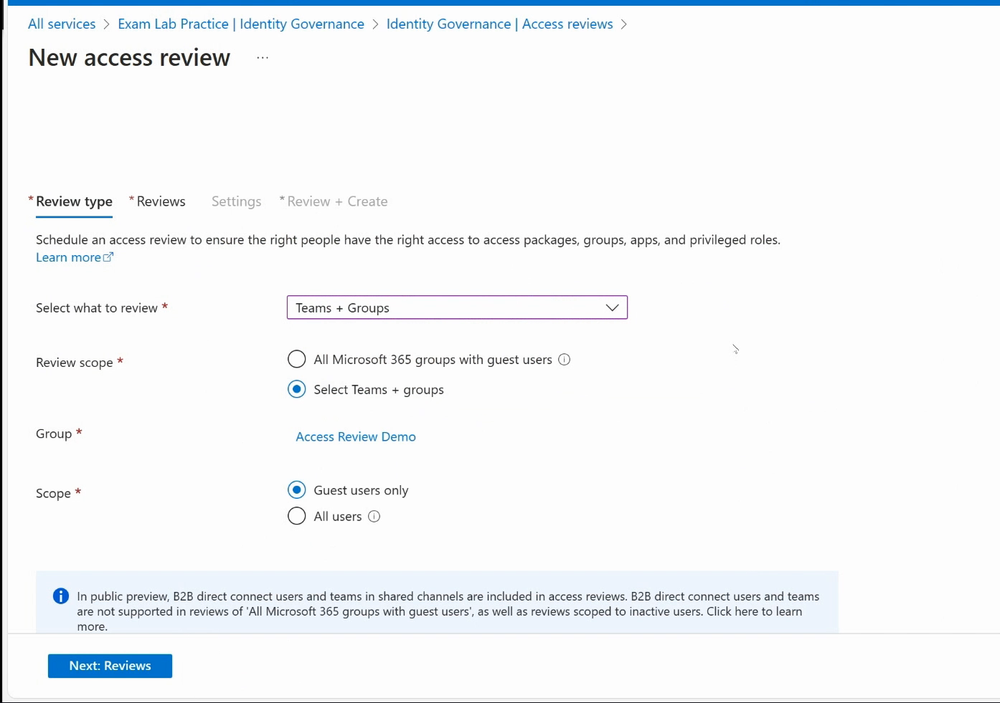
- 
- 
- 

## Design Governance
- Management group is a root hierarchial system that allows us to separate our different subscriptions
- Subscription allows us to purchase Azure resources.
- Even free resources need to be associated with a subscription
- 
- 
- Resource Groups cannot be nested
- 
- We can have a root management group and then have sub management groups below it
- Each management group can have subscriptions associated with it.
- 

### Administrative Units
- In Active Directory, we used to have Organization Units(OU)
- We used to put users inside of an OU and then we could delegate control over resources in that unit.
- Administrative Units(AU) are similar in concept but with some differences.
- AU help us to categorize our objects together and then we can delegate control over those objects to certain administrators.
- 
- 
- We need Azure AD Premium 1 license to create administrative units
- 
- 
- 
- 
- 
- In OU, 1 user can be member of one OU only. In AU, a user can be member of several AUs.
- 
- 
- 
- Microsoft Defender for Cloud gives us an overview of the security requirements for our cloud infrastructure.
- We need to pay close attention to security recommendations
- 
- 

## Design Identities and Access for Applications
- 
- Use principle of least privilege
- In Zero Trust Model, we follow JIT Model
- For this we use PIM
- In Azure we have Conditional Access Policies and Compliance Access Policies.
- Zero trust model is all about verifying everything

### Azure Key Vault
- 
- 
- 
- In Azure Key vault we can setup permission model either to be a Vault Access Policy or Azure RBAC.
- 
- In Vault access policy we can decide who can do what inside the key vault like whether we can create a key, certificate etc.
- Access Control(IAM) blade allows us to control who has access to these access policies and whether he/she can change the access policy.
- Azure Key Vault is a way to allow tenants or users in Azure to manage their encryptions like encryption keys.
- 
- 
- 
- We can also rotate our keys inside the Azure Key Vault
- 
- 
- 
- We can also do a soft delete of a key

### Application Access Registration(App Registrations) in Azure AD
- Suppose a web app is hosted on-prem on a webserver.
- We want that application to be tied to Azure AD and allow Azure AD to authenticate users and provide a token and control who gets access to that application.
- We want to use Azure AD to authenticate our users on that web app.
- Azure AD has a concept of App Registration and we can generate an access token which is passed to the web-server.
- 
- 
- This will generate an access token and it will be passed to the web app and the developer needs to use it accordingly
- 
- 
- 
- We have a bunch of endpoints associated with it which the developer needs to use to authenticate the token
- 

### Azure AD Application Proxy
- It is a feature of Azure AD that enables users to access on-premise web applications from a remote client.
- Application proxy includes both the Application Proxy service which runs in the cloud and the Application Proxy connector which runs on an on-premises server.
- Think of it as an alternative to Reverse Proxy.
- Azure AD, Application Proxy and Application Proxy connector work together to securely pass the user sign-on token from Azure AD to the web application.
- 
- This way we can host an application inside of our own private network and Application Proxy will act as a middleman between our web application hosted in house and the regular internet users.
- 
- 
- Application proxy ensures that we dont have to open any inbound connections to our firewall
- 
- 
- 
- 
- We can download and install the agent on our on-prem server.
- 
- 
- 
- 
- 
- Http Only cookie prevents against XSS attacks, cross site scripting attacks
- Persistent cookies donot expire when browser is closed.
  
## Designing Data Storage Solution for Relational Data.
- 
- 
- 
- 
- 
- 
- 
- 
- 
- 
- 
- 
- For traffic routing we can use Microsoft Network routing or Internet Routing. 
- Microsoft Network routing is more secure and fast but costs more money.
- 
- 
- 
- 
- 
- We can add role assignment conditions also
- 
- 
- We most commonly interact with storage account through web applications hosted on web servers.
- Storage Accounts store blobs which are great for storing music/video/images etc.
- To access storage account data, we have storage access keys.
- 
- We can also rotate the keys
- For temporary access we use SAS tokens
- 
- 
- 
- 
- The signature part of the SAS token ensures that the parameters of the SAS token are not manipulated with.

### Stored Access Policies
- 
- 
- 
- We can associate SAS tokens to the shared access policy
- 
- We can edit the stored access policy also

### Storage Redundancy in Azure
- 
- We have synchronous and asynchronous replication of data.
- 
- Each region usually has 3 zones.
- 
- 
- 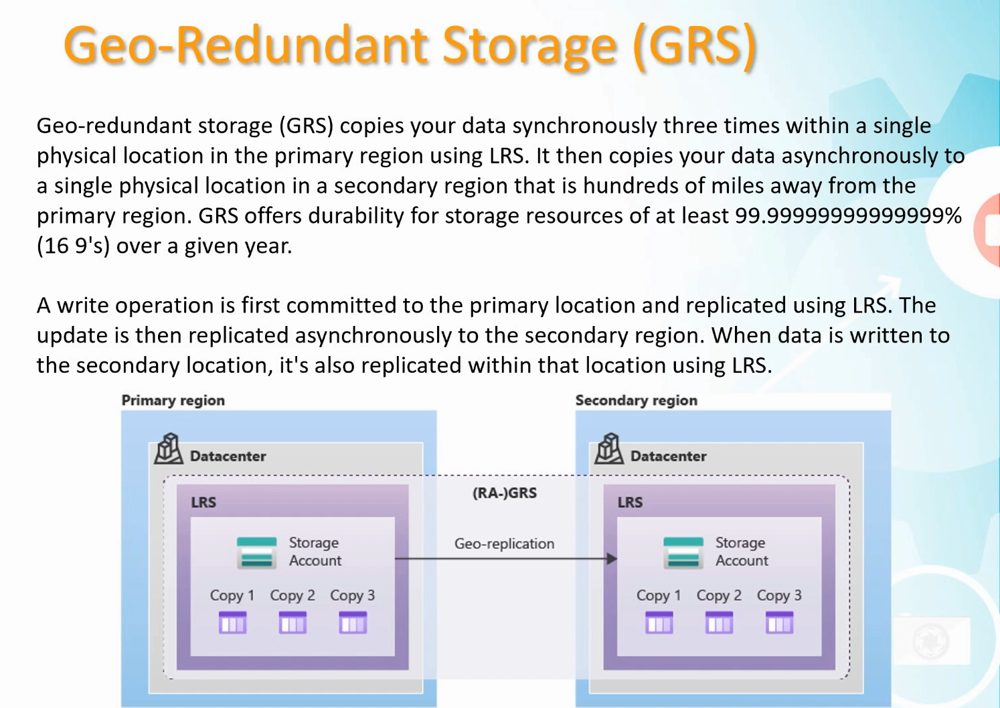
- 
- 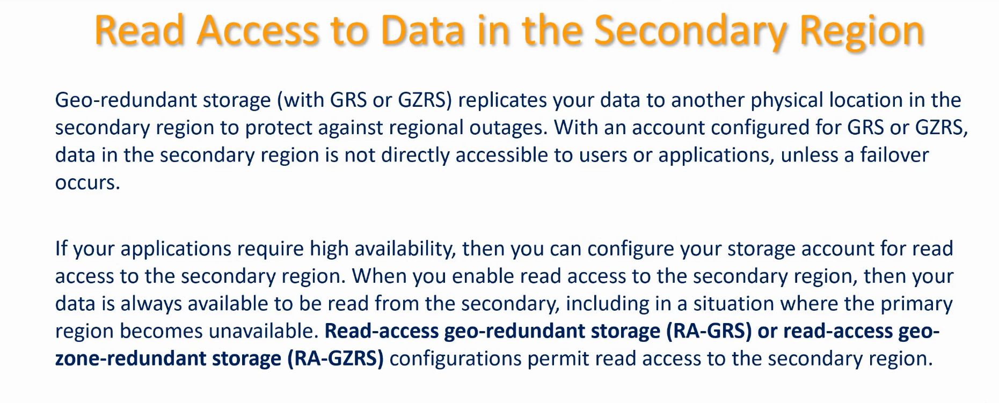
- 
- 
- 

### Object Replication
- Here we can have data inside a storage account replicate to another storage account
- 
- 
- 

### FileShare Storage
- Traditionally we would set up a file server which would follow the SMB protocol
- 
- 
- 
- Premium File Shares are supported only with Premium Storage Accounts
- We also have ability of Soft Delete for FileShares
- 
- 
- Earlier port 445 used to be used by hackers a lot. So lot of ISP's block that port. For this purpose we may need to setup site to site or point to site VPN or ExpressRoute to tunnel traffic directly over port 445.
- 

### Working with Blob Storage Management
- Blob storage is geared towards webservices.
- It support HTTPS, REST
- 

### Blob Lifecycle Management
- 
- 
- 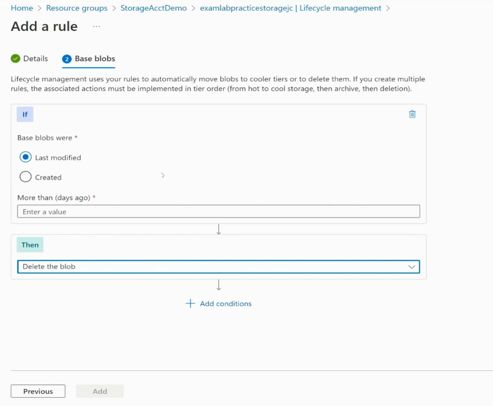
- 
- 
- Restoring from Archive tier can take more than 2 hours

### Relational Databases
- 
- 
- 
- 

### Service Tiers for Azure SQL
- 

## Designing for Data Integration
- Creating an Azure VM with SQL as a relational data storage solution
- 
- 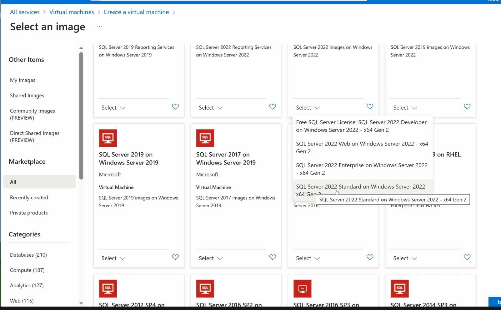
- 
- 
- We can assign a DNS name to our SQL Server VM
- 
- 
- We can create an Azure SQL Database also
- 
- 
- 
- 
- 

## Recommend a data storage solution
- Azure offers a choice of SQL and NoSQL databases
- 
- 
- 
- 
- 
- 
- 
- 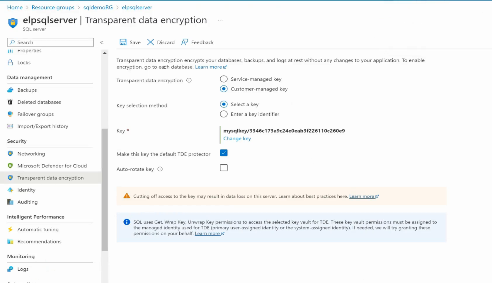
- 
- 

## Design a data storage solution for non-relational data
- 
- 
- 
- 
- 
- 
- 
- 

### Capacity Planning
- 
- Provisioned throughput does support autoscaling

### Using Cosmos DB
- 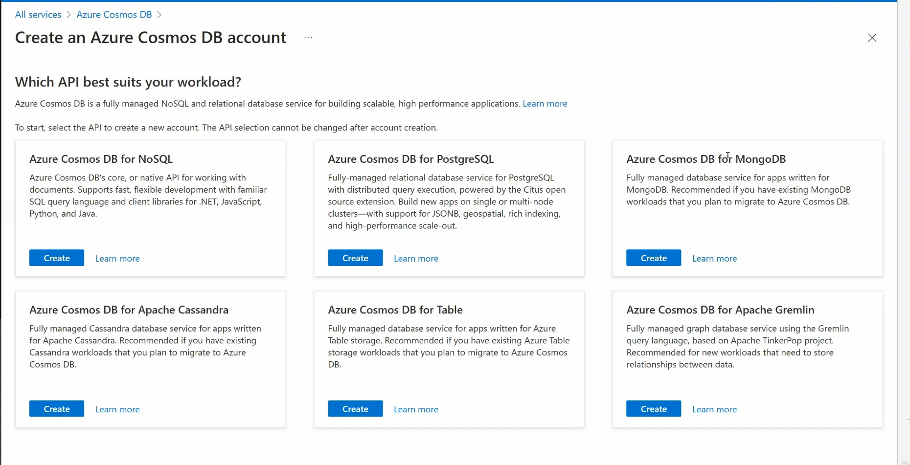
- 
- 
- 
- 
- 

### Data Lake Storage
- 
- 
- 
- 
- 
- 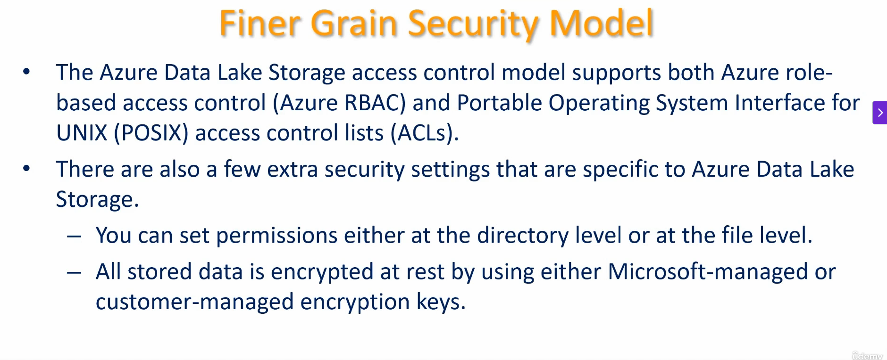
- 
- To create data lake storage, we need to select a premium storage account and must select Block Blobs
- 
- This will enable us to enable a hierarchial namespace.
- Hierarchial namespace is required for data lakes storage
- 

### Understanding Azure Databricks Storage
- 
- 
- 
- 
- 

### Using Azure Synapse(Analytics System that integrates with Azure Datalakes and Azure Databricks)
- 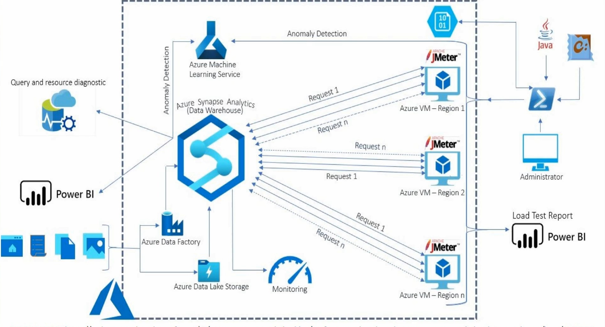
- Azure Synapse can help us with Azure Machine Learning and Power BI and Intelligence.
- Synapse must be added as a resource provider in Azure
- 
- 
- We need to create a SQL database and server that can work with Azure Synapse.
- 
- 
- 
- 
- Synapse analytics requires a SQL pool.
- 
- Azure Databricks: Primarily geared toward data preparation, big data processing, and machine learning model development. It excels in handling large-scale data with Apache Spark, building ETL pipelines, and managing the full ML lifecycle (using MLflow). It’s ideal for data engineers and data scientists focused on creating and deploying ML models, such as demand forecasting or anomaly detection in your supply chain use case.
- Azure Synapse Analytics: Geared toward end-to-end analytics, including data warehousing, visualization, and key insights. It combines Spark for big data processing with high-performance SQL pools for enterprise-grade querying and reporting, making it a strong choice for business intelligence (BI) and actionable insights via tools like Power BI. It’s better suited for scenarios where SQL-based analytics and dashboards are critical for decision-makers.
- Key Nuance:
- Databricks can support visualization (e.g., via notebooks or integration with BI tools), but it’s less optimized for enterprise data warehousing and SQL-heavy reporting compared to Synapse.
- Synapse can handle ML tasks (via Azure Machine Learning or Spark), but it’s not as streamlined for ML lifecycle management as Databricks.
- For your supply chain use case, choose Databricks if your focus is on building ML-driven solutions (e.g., predictive models) or Synapse if you need robust data warehousing and BI visualizations for stakeholders. You could also use both together: Databricks for data prep and ML, Synapse for storage and reporting.
- 
- 
- 

### Understanding Azure Data Factory
- 
- 
- 
- 
- 
- 
- 
- 
- 
- 
- 
- 
- - ADF serves as the glue that connects and coordinates data flows between systems, including Azure Databricks and Azure Synapse Analytics. It ensures data is ingested, transformed, and delivered to the right platforms for processing, analysis, or visualization.
- Problem: Supply chain data resides in multiple sources (e.g., on-premises ERP systems like SAP, cloud-based CRMs like Salesforce, IoT devices, supplier APIs, or external data like weather APIs), making it hard to consolidate.
- Solution: ADF connects to a wide range of sources via built-in connectors (over 100+ supported data stores, including SQL Server, Oracle, REST APIs, and Azure services). It ingests raw data into a centralized storage like Azure Data Lake Storage, which can then be accessed by Databricks or Synapse.
- How It Helps: Automates the extraction of scattered data, ensuring a steady flow of fresh data for real-time or batch processing in your analytics pipeline.
- Developer Task: Create ADF pipelines using the drag-and-drop UI in ADF Studio to connect to sources, schedule data ingestion, and copy data to Azure Data Lake.
- Problem: Preparing data for analysis or ML requires complex transformations (e.g., cleaning, aggregating, joining sales and inventory data), which must be coordinated across tools.
- Solution: ADF orchestrates ETL (Extract-Transform-Load) or ELT (Extract-Load-Transform) workflows. It triggers data transformations in Databricks (e.g., using Spark notebooks for ML prep) or Synapse (e.g., using Data Flows or SQL scripts) and loads the processed data into target systems (e.g., Synapse SQL pools for reporting).
- How It Helps: Ensures seamless data movement and transformation across your analytics stack, reducing manual effort and errors.
- Developer Task: Use ADF’s Mapping Data Flows for lightweight transformations or trigger Databricks notebooks/Synapse pipelines within ADF workflows. Define dependencies and schedules to automate the process.
- Role in the Pipeline: ADF is the orchestrator that feeds data into Databricks and Synapse, triggers their processing jobs, and moves results to downstream systems. It doesn’t perform heavy data processing or analytics itself but coordinates the workflow.
- With Databricks: ADF ingests raw data into Azure Data Lake, triggers Databricks notebooks for data prep or ML model training (e.g., demand forecasting), and moves processed data (e.g., Delta Lake tables) to Synapse or other stores.
- With Synapse: ADF is embedded in Synapse Studio, allowing seamless orchestration of Synapse’s Data Flows, SQL scripts, or Spark jobs. It also loads processed data into Synapse’s SQL pools for BI reporting or Power BI dashboards.
- Example Workflow:
- ADF ingests sales, inventory, and supplier data into Azure Data Lake.
- ADF triggers a Databricks notebook to preprocess data and train an ML model for demand forecasting.
- ADF moves the processed data and model predictions to Synapse’s SQL pool.
- Synapse generates reports, and ADF triggers Power BI refresh for stakeholder dashboards.

### Using Azure Data Factory for copying data into Azure Synapse Analytics
- 
- 
- 
- 
- 
- 
- 
- 
- 

## Design a solution for backup and disaster recovery
- 

### Using Recovery Services Vault
- 
- It has 2 main sections: Backup and Site Recovery
- 
- 
- 
- In Azure Site Recovery, we can setup VM replication

### Backup policies for RTO and RPO
- 
- We can create our custom backup policies
- 
- 

### Implementing Azure Backup for storage and compute resources
- There are 2 ways of doing backups: snapshots and backup
- 
- 
- We have more options in Recovery Services Vault
- 
- 
- 
- For VMs we can backup like this
- 
- 
- We can view the backup logs like this
- 
- 
- 
- We can also view the backup jobs like this
- 
- Similarly we can look at Site Recovery Jobs

## Design for High Availability
- We can make use of availability zones
- Each availability zone has its own power, networking and cooling
- Availability zones have very fast replication
- Synchronous replication is possible
- 
- 
- Availability zones protect us from data center outage not from regional outage

### Azure Site Recovery
- 
- 
- 
- 
- 
- 
- 
- 
- 
- We can create recovery plans inside azure site recovery
- 
- 
- 
- One example of recovery plan is like this
- 
- 
- We can enable replication of VMs
- 
- 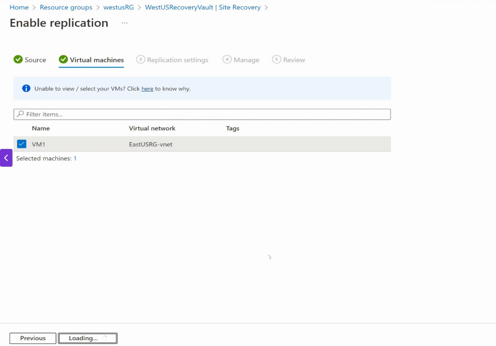
- 
- 
- 

### Replicating Data Storage to provide high availability
- We have option of object replication to replicate data between storage accounts
- 
- 
- 

## Design compute solutions
- For users who want Windows OS in the cloud, we have option of Windows 365.
- We can have a thin client connecting to the cloud and then host Windows in the cloud and that machine can stream to the thin client.
- This allows us to have a powerful machine at a low cost.
- Another option is Azure Virtual Desktop. This allows us to setup host pools.
- 
- We can have a bunch of virtual machines in a pool and the user data can also be saved in the cloud.
- This is very useful for mid/large scale businesses.
- For smaller businesses, Windows 365 is a better solution.
- 
- 
- 
- 
- 

### Understanding container based compute solutions(like AKS, ACI, Container Apps)
- 
- Azure supports Windows Based and Linux based containers
- 
- 
- 
- 
- 
- 
- 
- 
- 
- 
- 
- 

### Using AKS and AKS scaling
- 
- 
- 
- 
- ACI deploys faster than AKS
- ACI is more suitable for burstable workloads
- Azure Container Groups (via ACI) are not obsolete; they serve a distinct and valuable purpose for specific, often simpler or burstable, container workloads. The "better alternative" depends entirely on your application's requirements regarding complexity, scalability, orchestration needs, and the level of infrastructure management you want to handle. Many organizations use a combination of these services to optimize for different parts of their architecture.
- 
- 
- 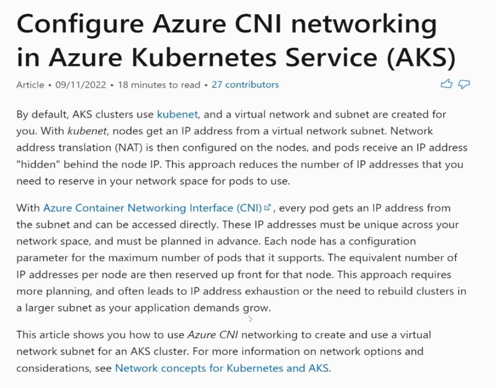
- 
- 
- 
- 
- 
- 
- 
- 
- 
- 

## Designing Application Architecture
- 
- 
- 
- 
- 
- 
- 
- For managing application development we have Azure Devops
- 
- 
- 
- 
- 
- 
- 
- 
- 
- 
- 
- 
- 
- 
- 
- 
- 

### Deploying a Devops application to Azure App Service
- 
- 
- 
- 
- 
- 
- 
- 
- 
- 
- 
- Scale Up is a choosing a different App Service Plan and Scale Out utilizes autoscaling to increase instance counts.
- 
- 
- 
- 
- We can create an App Service inside an App Service Plan
- 
- 
- 
- 
- 
- 
- Private endpoints help to connect App Service to a Vnet
- 
- 
- In the context of Azure App Services, Hybrid Connections is a feature that allows an Azure App Service (such as a web app, API app, or mobile app) to securely connect to on-premises resources or resources in a private network (e.g., databases, file servers, or services) without requiring a VPN or exposing those resources to the public internet. It provides a way to integrate cloud-based applications with on-premises systems.
- A lightweight agent called the Hybrid Connection Manager is installed on a Windows machine in the on-premises network.
- The HCM facilitates the connection between the Azure App Service and the on-premises resource by relaying traffic through Azure's Service Bus Relay.
- 
- 
- 
- 
- Go to the custom DNS provider(like GoDaddy) and add the TXT record to validate the domain name
- 
- 
- 

### Azure API Management
- 
- 
- 
- 
- 
- 

## Designing Migrations in Azure
- 
- Rebuild Migration needs to be done when we have out of date software and out of date web applications
- For re-architecting migrations we can make use of microservices.
- Microservices help to provide redundancy and high availability.
- Most common solution is refactoring. Here we make use of PaaS solutions. Rather than hosting the web application inside a VM, we can make use of serverless solutions.
- Lift and shift is just to move the VM from on-prem to Azure. Here we can make use of tools like AzCopy

### Using import and export jobs
- What if we want to move 500TB of data to the cloud.
- We can make use of Azure Databox and create an import/export job
- 
- 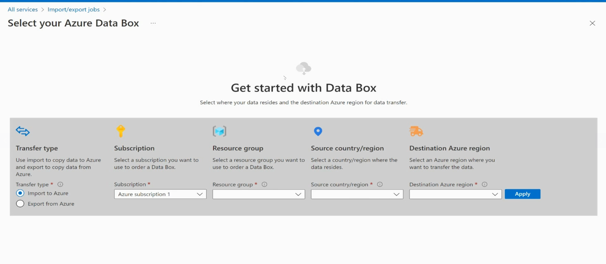
- 
- To ensure integrity of data, we generate a journal *.jrn file using the WAImportExport Tool
- 

### Using Azure Storage Explorer and AzCopy
- We can download Azure Storage Explorer tool to upload data to our storage account
- 
- 
- AzCopy is a command line tool which can be used to upload files to Azure
- We need to specify SAS token for AzCopy to work
- 
- 

### Migrating from a SQL Server Database to Azure SQL Database
- We will first create SQL Server on a VM and an Azure SQL Database
- We will make use of Azure Database Migration Service
- 
- 
- We will install Azure Data Studio
- We will install the Azure SQL Migration Extension
- 
- 
- 
- 
- 
- 
- 
- 
- Register the Microsoft.DataMigration ResourceProvider Service in Azure Subscription
- 
- Install the Microsoft Integration Runtime
- 
- 
- 
- 
- 
- 
- 

## Design Network Solutions in Azure
- We can place an NSG on either a Vnet or Subnet
- We can have a hub and spoke model where all traffic from internet comes on one Hub Vnet and there are other Vnets which protect other Azure resources.
- We need to make sure there are no address space conflicts between the on-prem network and the connected Azure Vnets
- Subnets in the same Vnet can talk to each other
- For communicating between Vnets we use peering
- Hub Vnet can have the Azure Firewall
- For other Vnets to filter traffic we can use NSGs
- Azure Firewall is also a virtual appliance
- We can also use UDR(user defined routes) to direct traffic through something
- 
- 
- Some services require their own subnets
- Examples include VPN Gateway,ExpressRoute, Azure Application Gateway
- 
- 
- We can delegate subnets to some Azure Services
- Subnet delegation in Azure is needed to dedicate a subnet to a specific Azure service, granting that service explicit control over the subnet's resources. Here's why it's important:
- Service-Specific Management: Some Azure services, like Azure App Service Environment or Azure Kubernetes Service (AKS), require dedicated subnets to operate. Delegation ensures the service can manage network configurations, such as IP address allocation, without interference from other resources.
- Improved Security: By delegating a subnet to a single service, you isolate its network traffic and configurations, reducing the risk of misconfiguration or unauthorized access from other resources in the virtual network (VNet).
- Compliance with Service Requirements: Certain Azure services mandate subnet delegation to function correctly. For example, Azure SQL Managed Instance requires a delegated subnet to enforce specific network policies and ensure high availability.
- Simplified Network Management: Delegation allows the Azure service to handle subnet-specific settings, reducing the administrative burden on you to manually configure and maintain network rules or IP assignments.
- Enhanced Integration: Delegated subnets enable seamless integration with Azure services, ensuring they can leverage VNet features like network security groups (NSGs), user-defined routes (UDRs), or private endpoints while maintaining service-specific optimizations.
- 
- A Public IP Prefix in Azure is a reserved range of contiguous public IP addresses allocated from Azure's public IP address pool. It allows you to assign multiple public IPs from a single, predictable block to your Azure resources. Here's a concise overview:

- Purpose: Ensures consistent and predictable IP addresses for resources like virtual machines, load balancers, or application gateways, simplifying management and reducing IP fragmentation.
Key Features:
- Contiguous IPs: You get a range (e.g., /28 prefix provides 16 IPs) of sequential public IPs.
- Static or Dynamic: IPs from the prefix can be assigned as static (fixed) or dynamic (changeable) to resources.
Simplified Whitelisting: Using a prefix range (e.g., 203.0.113.0/28) is easier for firewall rules or external systems than managing individual IPs.
- Use Cases:
- Scaling applications requiring multiple public IPs (e.g., load balancers for high availability).
- Environments needing consistent IPs for external connectivity or compliance.
- Simplifying network configurations for large deployments.
- Availability: Supported in all Azure regions, with prefix sizes ranging from /31 (2 IPs) to /24 (256 IPs), depending on the service and region.
- Public IP Prefixes streamline IP management, enhance reliability, and improve control over public-facing Azure resources.
- 
- 
- 
- 
- 
- 
- 
- 
- 
- 
- 
- 

### Understanding how NSG and ASG help optimize network security
- NSGs/ASGs help us with IP filtering
- NSG can be placed on a subnet or a virtual NIC directly
- In NSGs, the most restrictive NSG rule always wins. DENY always wins over ALLOW
- Microsoft recommends not to have lot of NSGs
- Some VMs may have multiple vNICs
- ASG --> Application Security Group
- ASG can be associated over a VM and can be applied over multiple vNICs

### Azure Firewall
- 
- 
- 
- 
- 
- 
- 
- Azure resources dont automatically start using the Azure firewall. We have to make a route table and have user defined routes so that we can make the incoming traffic flow through the firewall.
- 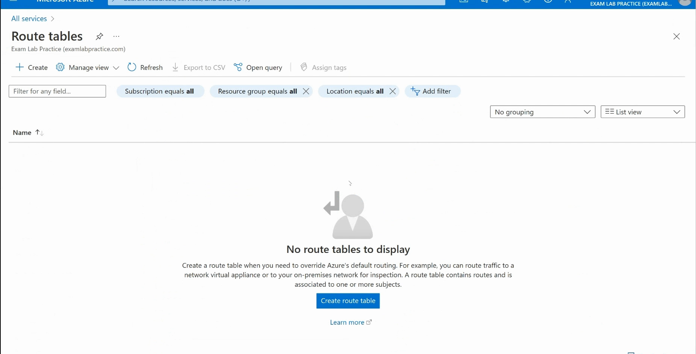
- 
- 
- 
- 
- We need to associate the route with the subnet containing our VMs
- 

### Understanding Azure Load Balancing Solutions
- 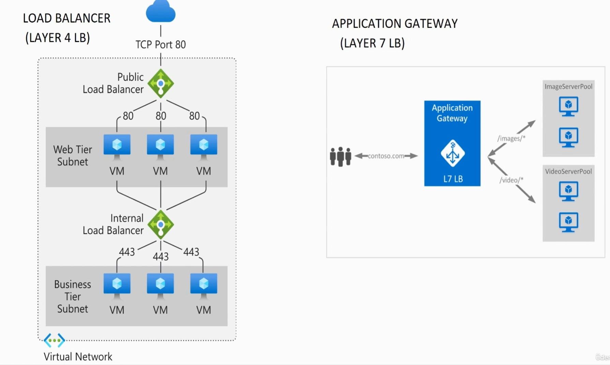
- In OSI Model, the higher the layer number, the more intelligent it is and has more capabilities.
- Application Gateway is more expensive than Layer 4 Load Balancer.
- In Load balancers, we have health probes that monitor the VMs
- Application GW can do the same thing as regular load balancers but we can also do URL based load balancing.
- 
- We can do load balancing based on DNS names, folder names etc in Application GW.
- 
- 
- 
- 

### Using Health Probes in Load Balancer
- 
- 
- 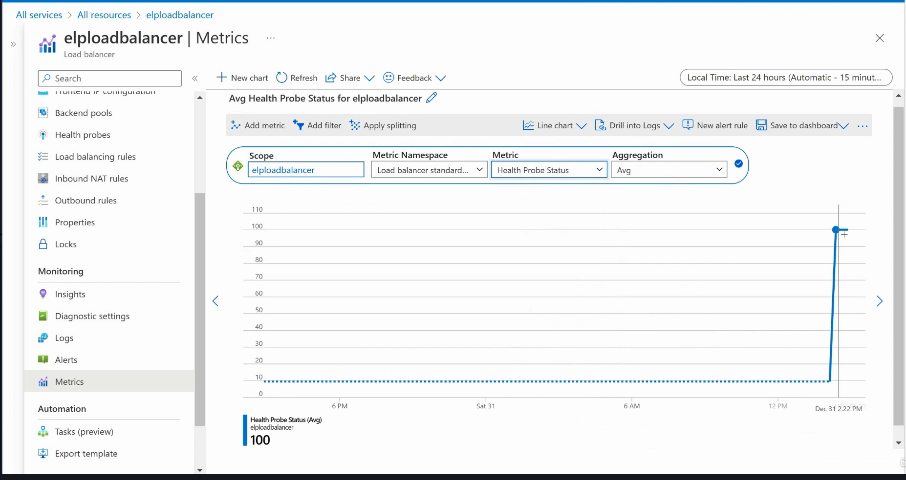